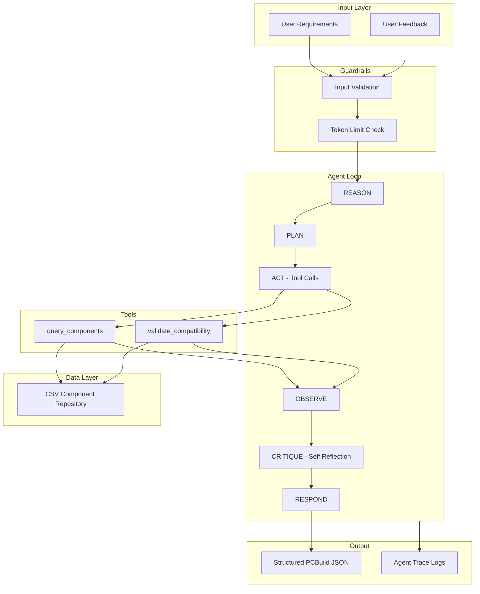

# GenAI PC Configuration Agent — Run Report

## Architecture Overview



### Agent Goal

Assist users in configuring a **compatible, budget-aware PC build** using only components from the provided dataset.

### Available Tools

| Tool | Purpose |
|------|---------|
| `query_components` | Filter dataset by category, price, socket, form factor, brand, keyword |
| `validate_compatibility` | Check socket match, memory generation, PSU wattage, GPU clearance |

### Advanced Techniques Used

- **Chain-of-thought prompting** — system prompt instructs internal reasoning before tool use
- **Self-critique** — draft build is reviewed for budget/compatibility before responding
- **Structured output** — Pydantic models (`PCBuild`, `UserRequirements`, `AgentTrace`)


## Design Decisions and Trade-offs

### Custom agent loop vs. LangChain/LangGraph

A lightweight custom loop was chosen to keep the project readable and demonstrate direct control over the `reason → plan → act → observe → respond` flow. LangGraph would add value for multi-agent orchestration but increases setup complexity for a focused assessment.

### Deterministic planner + LLM layer

The LLM handles requirement extraction and self-critique. Component selection uses a **deterministic planner** that queries the dataset via tools. This prevents hallucinated SKUs and keeps builds reproducible for evaluation. Trade-off: the planner is heuristic, not globally optimal.

### Mock LLM mode

`USE_MOCK_LLM=true` enables full end-to-end runs without API keys. Useful for CI and graders. Live mode uses OpenAI with retries, timeouts, and JSON response format.

### Compatibility validation in code

Compatibility rules (socket, DDR generation, PSU estimate, GPU length warnings) are implemented in Python rather than left to the LLM. This improves correctness and provides inspectable validation output.

### Dataset socket inference

CPUs in the dataset lack explicit socket columns. Socket is inferred from microarchitecture and product name heuristics. This is imperfect for legacy parts but sufficient for modern builds.

### Known limitations

- Budget allocation is heuristic; builds may under-spend on high budgets
- No RAG embedding index (dataset filtering is structured query, not semantic search)
- Single-turn feedback revision (not full multi-session memory)


## Evaluation Scenarios Tested

The agent was tested against 5 diverse scenarios to validate core functionality:

| Scenario | User Input | Feedback | Expected Outcomes | Status |
|----------|-----------|----------|-------------------|--------|
| **budget_office** | "I need a $600 PC for web browsing and school work." | None | Feasible build, within budget, has CPU/motherboard/memory | ✓ Pass |
| **gaming_amd** | "Build me a 1440p gaming PC around $1500. I prefer AMD." | None | Feasible build, has GPU, AMD CPU preference honored | ✓ Pass |
| **infeasible_flagship_gpu** | "I want an RTX 4090 build for $800 total." | None | Correctly identifies as infeasible (impossible budget) | ✓ Pass |
| **feedback_cheaper_gpu** | "Gaming PC around $1400 for 1440p." | "Please make the GPU cheaper." | Feasible build, user feedback applied in revision | ✓ Pass |
| **content_creation** | "Video editing workstation with 32GB RAM, budget $1800." | None | Feasible build, includes adequate storage | ✓ Pass |

---

## Primary Run Trace

# Agent Trace `28284e52-8c54-4a44-8de1-57e1e65c2abb`

**User input:** Gaming PC around $1400 for 1440p

## Steps
### 1. REASON
Interpreting user goals, budget, preferences, and constraints.

### 2. PLAN
Planning component queries for usage=gaming, budget=1400.0.

### 3. ACT
Executed tool `query_components`.
- Tool: `query_components`
- Input: `{"category": "cpu", "max_price": 308.0, "min_price": 150.0, "socket": null, "form_factor": null, "brand_preference": null, "keyword": null, "limit": 40}`
- Output: `{"category": "cpu", "count": 40, "total_matches": 157, "results": [{"name": "Intel Core i7-960", "price": 150.0, "socket": null, "form_factor": null, "memory_type": null, "wattage": null, "tdp": "130", "chipset": null, "capacity": null, "modules": null, "length": null}, {"name": "Intel Core i5-13400F", "price": 151.47, "socket": "LGA1700", "form_factor": null, "memory_type": null, "wattage": null, "tdp": "65", "chipset": null, "capacity": null, "modules": null, "length": null}, {"name": "Intel Core i7-7700K", "price": 151.69, "socket": "LGA1151", "form_factor": null, "memory_type": null, "wattage": null, "tdp": "91", "chipset": null, "capacity": null, "modules": null, "length": null}, {"name": "Intel Core i3-2125", "price": 152.0, "socket": "LGA1155", "form_factor": null, "memory_type": null, "wattage": null, "tdp": "65", "chipset": null, "capacity": null, "modules": null, "length": null}, {"name": "AMD Ryzen 5 8500G", "price": 152.5, "socket": "AM5", "form_factor": null, "memory_type": null, "wattage": null, "tdp": "65", "chipset": null, "capacity": null, "modules": null, "length": null}, {"name": "Intel Pentium G3470", "price": 153.1, "socket": "LGA1150", "form_factor": null, "me`

### 4. OBSERVE
Processed tool output and updated build draft.
- Tool: `query_components`
- Output: `{"category": "cpu", "count": 40, "total_matches": 157, "results": [{"name": "Intel Core i7-960", "price": 150.0, "socket": null, "form_factor": null, "memory_type": null, "wattage": null, "tdp": "130", "chipset": null, "capacity": null, "modules": null, "length": null}, {"name": "Intel Core i5-13400F", "price": 151.47, "socket": "LGA1700", "form_factor": null, "memory_type": null, "wattage": null, "tdp": "65", "chipset": null, "capacity": null, "modules": null, "length": null}, {"name": "Intel Core i7-7700K", "price": 151.69, "socket": "LGA1151", "form_factor": null, "memory_type": null, "wattage": null, "tdp": "91", "chipset": null, "capacity": null, "modules": null, "length": null}, {"name": "Intel Core i3-2125", "price": 152.0, "socket": "LGA1155", "form_factor": null, "memory_type": null, "wattage": null, "tdp": "65", "chipset": null, "capacity": null, "modules": null, "length": null}, {"name": "AMD Ryzen 5 8500G", "price": 152.5, "socket": "AM5", "form_factor": null, "memory_type": null, "wattage": null, "tdp": "65", "chipset": null, "capacity": null, "modules": null, "length": null}, {"name": "Intel Pentium G3470", "price": 153.1, "socket": "LGA1150", "form_factor": null, "me`

### 5. ACT
Executed tool `query_components`.
- Tool: `query_components`
- Input: `{"category": "motherboard", "max_price": 220.0, "min_price": null, "socket": "LGA1700", "form_factor": null, "brand_preference": null, "keyword": null, "limit": 10}`
- Output: `{"category": "motherboard", "count": 10, "total_matches": 109, "results": [{"name": "ASRock H610M-HDV/M.2+ D5", "price": 89.57, "socket": "LGA1700", "form_factor": "Micro ATX", "memory_type": null, "wattage": null, "tdp": null, "chipset": null, "capacity": null, "modules": null, "length": null}, {"name": "ASRock H610M/ac", "price": 89.99, "socket": "LGA1700", "form_factor": "Micro ATX", "memory_type": null, "wattage": null, "tdp": null, "chipset": null, "capacity": null, "modules": null, "length": null}, {"name": "Asus PRO H610M-CT D4-CSM", "price": 89.99, "socket": "LGA1700", "form_factor": "Micro ATX", "memory_type": null, "wattage": null, "tdp": null, "chipset": null, "capacity": null, "modules": null, "length": null}, {"name": "MSI PRO H610M-G DDR4", "price": 93.99, "socket": "LGA1700", "form_factor": "Micro ATX", "memory_type": null, "wattage": null, "tdp": null, "chipset": null, "capacity": null, "modules": null, "length": null}, {"name": "MSI PRO B760M-P DDR4", "price": 99.99, "socket": "LGA1700", "form_factor": "Micro ATX", "memory_type": null, "wattage": null, "tdp": null, "chipset": null, "capacity": null, "modules": null, "length": null}, {"name": "Asus B760M-AYW WIFI D4`

### 6. OBSERVE
Processed tool output and updated build draft.
- Tool: `query_components`
- Output: `{"category": "motherboard", "count": 10, "total_matches": 109, "results": [{"name": "ASRock H610M-HDV/M.2+ D5", "price": 89.57, "socket": "LGA1700", "form_factor": "Micro ATX", "memory_type": null, "wattage": null, "tdp": null, "chipset": null, "capacity": null, "modules": null, "length": null}, {"name": "ASRock H610M/ac", "price": 89.99, "socket": "LGA1700", "form_factor": "Micro ATX", "memory_type": null, "wattage": null, "tdp": null, "chipset": null, "capacity": null, "modules": null, "length": null}, {"name": "Asus PRO H610M-CT D4-CSM", "price": 89.99, "socket": "LGA1700", "form_factor": "Micro ATX", "memory_type": null, "wattage": null, "tdp": null, "chipset": null, "capacity": null, "modules": null, "length": null}, {"name": "MSI PRO H610M-G DDR4", "price": 93.99, "socket": "LGA1700", "form_factor": "Micro ATX", "memory_type": null, "wattage": null, "tdp": null, "chipset": null, "capacity": null, "modules": null, "length": null}, {"name": "MSI PRO B760M-P DDR4", "price": 99.99, "socket": "LGA1700", "form_factor": "Micro ATX", "memory_type": null, "wattage": null, "tdp": null, "chipset": null, "capacity": null, "modules": null, "length": null}, {"name": "Asus B760M-AYW WIFI D4`

### 7. ACT
Executed tool `query_components`.
- Tool: `query_components`
- Input: `{"category": "memory", "max_price": 120.0, "min_price": 30.0, "socket": null, "form_factor": null, "brand_preference": null, "keyword": "DDR5", "limit": 20}`
- Output: `{"category": "memory", "count": 20, "total_matches": 679, "results": [{"name": "Kingston KTL-TP3CL/4G 4 GB", "price": 30.0, "socket": null, "form_factor": null, "memory_type": "DDR5", "wattage": null, "tdp": null, "chipset": null, "capacity": null, "modules": "1,4", "length": null}, {"name": "Crucial CT2K4G3S160BM 8 GB", "price": 30.95, "socket": null, "form_factor": null, "memory_type": "DDR5", "wattage": null, "tdp": null, "chipset": null, "capacity": null, "modules": "2,4", "length": null}, {"name": "Kingston ValueRAM 4 GB", "price": 30.99, "socket": null, "form_factor": null, "memory_type": "DDR5", "wattage": null, "tdp": null, "chipset": null, "capacity": null, "modules": "2,2", "length": null}, {"name": "Crucial CT2KIT51264BA160B 8 GB", "price": 31.2, "socket": null, "form_factor": null, "memory_type": "DDR5", "wattage": null, "tdp": null, "chipset": null, "capacity": null, "modules": "2,4", "length": null}, {"name": "Kingston KVR16E11/8 8 GB", "price": 31.34, "socket": null, "form_factor": null, "memory_type": "DDR5", "wattage": null, "tdp": null, "chipset": null, "capacity": null, "modules": "1,8", "length": null}, {"name": "Crucial CT8G3S1339M 8 GB", "price": 31.38, "socke`

### 8. OBSERVE
Processed tool output and updated build draft.
- Tool: `query_components`
- Output: `{"category": "memory", "count": 20, "total_matches": 679, "results": [{"name": "Kingston KTL-TP3CL/4G 4 GB", "price": 30.0, "socket": null, "form_factor": null, "memory_type": "DDR5", "wattage": null, "tdp": null, "chipset": null, "capacity": null, "modules": "1,4", "length": null}, {"name": "Crucial CT2K4G3S160BM 8 GB", "price": 30.95, "socket": null, "form_factor": null, "memory_type": "DDR5", "wattage": null, "tdp": null, "chipset": null, "capacity": null, "modules": "2,4", "length": null}, {"name": "Kingston ValueRAM 4 GB", "price": 30.99, "socket": null, "form_factor": null, "memory_type": "DDR5", "wattage": null, "tdp": null, "chipset": null, "capacity": null, "modules": "2,2", "length": null}, {"name": "Crucial CT2KIT51264BA160B 8 GB", "price": 31.2, "socket": null, "form_factor": null, "memory_type": "DDR5", "wattage": null, "tdp": null, "chipset": null, "capacity": null, "modules": "2,4", "length": null}, {"name": "Kingston KVR16E11/8 8 GB", "price": 31.34, "socket": null, "form_factor": null, "memory_type": "DDR5", "wattage": null, "tdp": null, "chipset": null, "capacity": null, "modules": "1,8", "length": null}, {"name": "Crucial CT8G3S1339M 8 GB", "price": 31.38, "socke`

### 9. ACT
Executed tool `query_components`.
- Tool: `query_components`
- Input: `{"category": "video_card", "max_price": 594.9515, "min_price": 180.0, "socket": null, "form_factor": null, "brand_preference": null, "keyword": "RTX", "limit": 30}`
- Output: `{"category": "video_card", "count": 30, "total_matches": 184, "results": [{"name": "MSI GAMING X", "price": 194.99, "socket": null, "form_factor": null, "memory_type": null, "wattage": null, "tdp": null, "chipset": "GeForce RTX 3050 6GB", "capacity": null, "modules": null, "length": "205"}, {"name": "Asus DUAL OC", "price": 199.97, "socket": null, "form_factor": null, "memory_type": null, "wattage": null, "tdp": null, "chipset": "GeForce RTX 3050 6GB", "capacity": null, "modules": null, "length": "201"}, {"name": "Yeston LP", "price": 205.0, "socket": null, "form_factor": null, "memory_type": null, "wattage": null, "tdp": null, "chipset": "GeForce RTX 3050 6GB", "capacity": null, "modules": null, "length": "160"}, {"name": "MSI LP OC", "price": 219.98, "socket": null, "form_factor": null, "memory_type": null, "wattage": null, "tdp": null, "chipset": "GeForce RTX 3050 6GB", "capacity": null, "modules": null, "length": "174"}, {"name": "MSI VENTUS 2X XS OC", "price": 219.99, "socket": null, "form_factor": null, "memory_type": null, "wattage": null, "tdp": null, "chipset": "GeForce RTX 3050 8GB", "capacity": null, "modules": null, "length": "205"}, {"name": "Gigabyte WINDFORCE OC", "p`

### 10. OBSERVE
Processed tool output and updated build draft.
- Tool: `query_components`
- Output: `{"category": "video_card", "count": 30, "total_matches": 184, "results": [{"name": "MSI GAMING X", "price": 194.99, "socket": null, "form_factor": null, "memory_type": null, "wattage": null, "tdp": null, "chipset": "GeForce RTX 3050 6GB", "capacity": null, "modules": null, "length": "205"}, {"name": "Asus DUAL OC", "price": 199.97, "socket": null, "form_factor": null, "memory_type": null, "wattage": null, "tdp": null, "chipset": "GeForce RTX 3050 6GB", "capacity": null, "modules": null, "length": "201"}, {"name": "Yeston LP", "price": 205.0, "socket": null, "form_factor": null, "memory_type": null, "wattage": null, "tdp": null, "chipset": "GeForce RTX 3050 6GB", "capacity": null, "modules": null, "length": "160"}, {"name": "MSI LP OC", "price": 219.98, "socket": null, "form_factor": null, "memory_type": null, "wattage": null, "tdp": null, "chipset": "GeForce RTX 3050 6GB", "capacity": null, "modules": null, "length": "174"}, {"name": "MSI VENTUS 2X XS OC", "price": 219.99, "socket": null, "form_factor": null, "memory_type": null, "wattage": null, "tdp": null, "chipset": "GeForce RTX 3050 8GB", "capacity": null, "modules": null, "length": "205"}, {"name": "Gigabyte WINDFORCE OC", "p`

### 11. ACT
Executed tool `query_components`.
- Tool: `query_components`
- Input: `{"category": "internal_hard_drive", "max_price": 120.0, "min_price": null, "socket": null, "form_factor": null, "brand_preference": null, "keyword": "SSD", "limit": 8}`
- Output: `{"category": "internal_hard_drive", "count": 8, "total_matches": 722, "results": [{"name": "Orico Y-20", "price": 10.99, "socket": null, "form_factor": "2.5", "memory_type": null, "wattage": null, "tdp": null, "chipset": null, "capacity": "128", "modules": null, "length": null}, {"name": "Patriot Burst Elite", "price": 12.49, "socket": null, "form_factor": "2.5", "memory_type": null, "wattage": null, "tdp": null, "chipset": null, "capacity": "120", "modules": null, "length": null}, {"name": "Patriot P220", "price": 13.49, "socket": null, "form_factor": "2.5", "memory_type": null, "wattage": null, "tdp": null, "chipset": null, "capacity": "128", "modules": null, "length": null}, {"name": "Patriot P300", "price": 14.99, "socket": null, "form_factor": "M.2-2280", "memory_type": null, "wattage": null, "tdp": null, "chipset": null, "capacity": "128", "modules": null, "length": null}, {"name": "Orico D10", "price": 14.99, "socket": null, "form_factor": "M.2-2280", "memory_type": null, "wattage": null, "tdp": null, "chipset": null, "capacity": "128", "modules": null, "length": null}, {"name": "Verbatim Vi550", "price": 14.99, "socket": null, "form_factor": "2.5", "memory_type": null, "wat`

### 12. OBSERVE
Processed tool output and updated build draft.
- Tool: `query_components`
- Output: `{"category": "internal_hard_drive", "count": 8, "total_matches": 722, "results": [{"name": "Orico Y-20", "price": 10.99, "socket": null, "form_factor": "2.5", "memory_type": null, "wattage": null, "tdp": null, "chipset": null, "capacity": "128", "modules": null, "length": null}, {"name": "Patriot Burst Elite", "price": 12.49, "socket": null, "form_factor": "2.5", "memory_type": null, "wattage": null, "tdp": null, "chipset": null, "capacity": "120", "modules": null, "length": null}, {"name": "Patriot P220", "price": 13.49, "socket": null, "form_factor": "2.5", "memory_type": null, "wattage": null, "tdp": null, "chipset": null, "capacity": "128", "modules": null, "length": null}, {"name": "Patriot P300", "price": 14.99, "socket": null, "form_factor": "M.2-2280", "memory_type": null, "wattage": null, "tdp": null, "chipset": null, "capacity": "128", "modules": null, "length": null}, {"name": "Orico D10", "price": 14.99, "socket": null, "form_factor": "M.2-2280", "memory_type": null, "wattage": null, "tdp": null, "chipset": null, "capacity": "128", "modules": null, "length": null}, {"name": "Verbatim Vi550", "price": 14.99, "socket": null, "form_factor": "2.5", "memory_type": null, "wat`

### 13. ACT
Executed tool `query_components`.
- Tool: `query_components`
- Input: `{"category": "power_supply", "max_price": 140.0, "min_price": null, "socket": null, "form_factor": null, "brand_preference": null, "keyword": "650", "limit": 10}`
- Output: `{"category": "power_supply", "count": 10, "total_matches": 33, "results": [{"name": "Montech APX", "price": 49.8, "socket": null, "form_factor": null, "memory_type": null, "wattage": "650", "tdp": null, "chipset": null, "capacity": null, "modules": null, "length": null}, {"name": "Apevia Galaxy", "price": 54.99, "socket": null, "form_factor": null, "memory_type": null, "wattage": "650", "tdp": null, "chipset": null, "capacity": null, "modules": null, "length": null}, {"name": "Apevia Premier", "price": 54.99, "socket": null, "form_factor": null, "memory_type": null, "wattage": "650", "tdp": null, "chipset": null, "capacity": null, "modules": null, "length": null}, {"name": "Segotep GN", "price": 59.99, "socket": null, "form_factor": null, "memory_type": null, "wattage": "650", "tdp": null, "chipset": null, "capacity": null, "modules": null, "length": null}, {"name": "Azza PSAZ-650W", "price": 59.99, "socket": null, "form_factor": null, "memory_type": null, "wattage": "650", "tdp": null, "chipset": null, "capacity": null, "modules": null, "length": null}, {"name": "ASRock Challenger CL-650B", "price": 62.99, "socket": null, "form_factor": null, "memory_type": null, "wattage": "650",`

### 14. OBSERVE
Processed tool output and updated build draft.
- Tool: `query_components`
- Output: `{"category": "power_supply", "count": 10, "total_matches": 33, "results": [{"name": "Montech APX", "price": 49.8, "socket": null, "form_factor": null, "memory_type": null, "wattage": "650", "tdp": null, "chipset": null, "capacity": null, "modules": null, "length": null}, {"name": "Apevia Galaxy", "price": 54.99, "socket": null, "form_factor": null, "memory_type": null, "wattage": "650", "tdp": null, "chipset": null, "capacity": null, "modules": null, "length": null}, {"name": "Apevia Premier", "price": 54.99, "socket": null, "form_factor": null, "memory_type": null, "wattage": "650", "tdp": null, "chipset": null, "capacity": null, "modules": null, "length": null}, {"name": "Segotep GN", "price": 59.99, "socket": null, "form_factor": null, "memory_type": null, "wattage": "650", "tdp": null, "chipset": null, "capacity": null, "modules": null, "length": null}, {"name": "Azza PSAZ-650W", "price": 59.99, "socket": null, "form_factor": null, "memory_type": null, "wattage": "650", "tdp": null, "chipset": null, "capacity": null, "modules": null, "length": null}, {"name": "ASRock Challenger CL-650B", "price": 62.99, "socket": null, "form_factor": null, "memory_type": null, "wattage": "650",`

### 15. ACT
Executed tool `query_components`.
- Tool: `query_components`
- Input: `{"category": "case", "max_price": 100.0, "min_price": null, "socket": null, "form_factor": "ATX Mid Tower", "brand_preference": null, "keyword": null, "limit": 8}`
- Output: `{"category": "case", "count": 8, "total_matches": 259, "results": [{"name": "Zalman T3 PLUS", "price": 39.5, "socket": null, "form_factor": null, "memory_type": null, "wattage": null, "tdp": null, "chipset": null, "capacity": null, "modules": null, "length": null}, {"name": "Zalman T8", "price": 42.95, "socket": null, "form_factor": null, "memory_type": null, "wattage": null, "tdp": null, "chipset": null, "capacity": null, "modules": null, "length": null}, {"name": "DIYPC DIY-S07", "price": 43.97, "socket": null, "form_factor": null, "memory_type": null, "wattage": null, "tdp": null, "chipset": null, "capacity": null, "modules": null, "length": null}, {"name": "Thermaltake Versa H21", "price": 47.99, "socket": null, "form_factor": null, "memory_type": null, "wattage": null, "tdp": null, "chipset": null, "capacity": null, "modules": null, "length": null}, {"name": "BGears b-Vortex-RGB", "price": 48.99, "socket": null, "form_factor": null, "memory_type": null, "wattage": null, "tdp": null, "chipset": null, "capacity": null, "modules": null, "length": null}, {"name": "Zalman S2", "price": 49.98, "socket": null, "form_factor": null, "memory_type": null, "wattage": null, "tdp": null, "c`

### 16. OBSERVE
Processed tool output and updated build draft.
- Tool: `query_components`
- Output: `{"category": "case", "count": 8, "total_matches": 259, "results": [{"name": "Zalman T3 PLUS", "price": 39.5, "socket": null, "form_factor": null, "memory_type": null, "wattage": null, "tdp": null, "chipset": null, "capacity": null, "modules": null, "length": null}, {"name": "Zalman T8", "price": 42.95, "socket": null, "form_factor": null, "memory_type": null, "wattage": null, "tdp": null, "chipset": null, "capacity": null, "modules": null, "length": null}, {"name": "DIYPC DIY-S07", "price": 43.97, "socket": null, "form_factor": null, "memory_type": null, "wattage": null, "tdp": null, "chipset": null, "capacity": null, "modules": null, "length": null}, {"name": "Thermaltake Versa H21", "price": 47.99, "socket": null, "form_factor": null, "memory_type": null, "wattage": null, "tdp": null, "chipset": null, "capacity": null, "modules": null, "length": null}, {"name": "BGears b-Vortex-RGB", "price": 48.99, "socket": null, "form_factor": null, "memory_type": null, "wattage": null, "tdp": null, "chipset": null, "capacity": null, "modules": null, "length": null}, {"name": "Zalman S2", "price": 49.98, "socket": null, "form_factor": null, "memory_type": null, "wattage": null, "tdp": null, "c`

### 17. ACT
Executed tool `validate_compatibility`.
- Tool: `validate_compatibility`
- Input: `{"components": [{"category": "cpu", "name": "Intel Core i5-12500", "price": 179.92, "rationale": "CPU matched to workload and budget"}, {"category": "motherboard", "name": "Biostar H610MT-E", "price": 105.36, "rationale": "Motherboard with socket LGA1700"}, {"category": "memory", "name": "G.Skill Ripjaws 16 GB", "price": 32.99, "rationale": "Memory sized for target workload"}, {"category": "video_card", "name": "MSI SHADOW 2X OC", "price": 299.99, "rationale": "Discrete GPU for gaming/content workloads"}, {"category": "internal_hard_drive", "name": "FanXiang S101", "price": 15.99, "rationale": "Primary SSD storage"}, {"category": "power_supply", "name": "SAMA GT", "price": 64.99, "rationale": "PSU with adequate wattage"}, {"category": "case", "name": "Cooler Master Elite 301", "price": 49.99, "rationale": "ATX case compatible with standard builds"}]}`
- Output: `{"compatible": true, "issues": [], "warnings": [], "estimated_psu_watts": 365}`

### 18. OBSERVE
Processed tool output and updated build draft.
- Tool: `validate_compatibility`
- Output: `{"compatible": true, "issues": [], "warnings": [], "estimated_psu_watts": 365}`

### 19. CRITIQUE
{}

### 20. RESPOND
Configured a gaming PC with 7 core components totaling $749.23.

## Final Build
```json
{
  "components": [
    {
      "category": "cpu",
      "name": "Intel Core i5-12500",
      "price": 179.92,
      "rationale": "CPU matched to workload and budget"
    },
    {
      "category": "motherboard",
      "name": "Biostar H610MT-E",
      "price": 105.36,
      "rationale": "Motherboard with socket LGA1700"
    },
    {
      "category": "memory",
      "name": "G.Skill Ripjaws 16 GB",
      "price": 32.99,
      "rationale": "Memory sized for target workload"
    },
    {
      "category": "video_card",
      "name": "MSI SHADOW 2X OC",
      "price": 299.99,
      "rationale": "Discrete GPU for gaming/content workloads"
    },
    {
      "category": "internal_hard_drive",
      "name": "FanXiang S101",
      "price": 15.99,
      "rationale": "Primary SSD storage"
    },
    {
      "category": "power_supply",
      "name": "SAMA GT",
      "price": 64.99,
      "rationale": "PSU with adequate wattage"
    },
    {
      "category": "case",
      "name": "Cooler Master Elite 301",
      "price": 49.99,
      "rationale": "ATX case compatible with standard builds"
    }
  ],
  "total_price": 749.23,
  "summary": "Configured a gaming PC with 7 core components totaling $749.23.",
  "compatibility_notes": [],
  "tradeoffs": [],
  "feasible": true,
  "infeasibility_reason": null
}
```