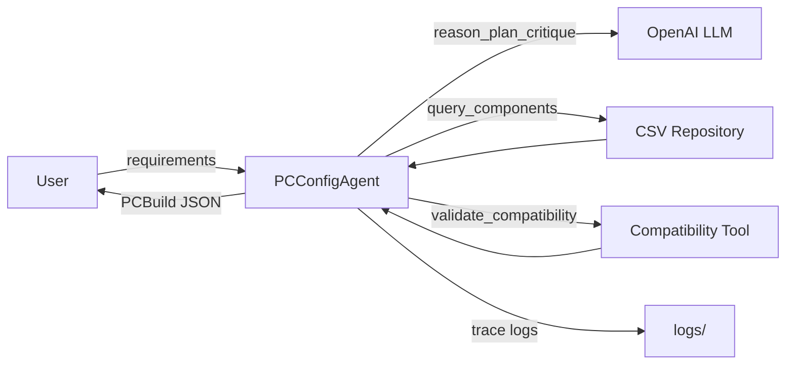

# GenAI PC Configuration Agent

An agentic AI application that helps users configure compatible PC builds from the [Computer Components Dataset](https://github.com/vinayak-ensemble/Computer_Components_Dataset).

## Features

- Requirement gathering from natural language (usage, budget, preferences)
- Dataset-grounded component selection via tool calls (no hallucinated SKUs)
- Compatibility validation (socket, memory, PSU wattage, GPU clearance)
- User feedback revision (e.g., "make the GPU cheaper")
- Self-critique before final response
- Full agent trace logging for observability
- Mock mode for running without an API key

## Architecture



### Agent Loop

```
REASON → PLAN → ACT → OBSERVE → CRITIQUE → RESPOND
```

| Module | Responsibility |
|--------|----------------|
| `src/agent/loop.py` | Orchestrates the agent loop and feedback handling |
| `src/agent/planner.py` | Deterministic build planner using dataset tools |
| `src/agent/llm_client.py` | LLM integration with retries and mock fallback |
| `src/tools/component_query.py` | Dataset query tool |
| `src/tools/compatibility.py` | Compatibility validation tool |
| `src/prompts/templates.py` | System prompts and few-shot examples |
| `src/models/schemas.py` | Pydantic structured output models |
| `src/guardrails/validation.py` | Input validation and safety guardrails |
| `src/logging/trace.py` | Step-by-step trace logging |
| `src/evaluation/runner.py` | Test scenarios and evaluation |

## Prerequisites

- Python 3.9+
- [Computer Components Dataset](https://github.com/vinayak-ensemble/Computer_Components_Dataset) cloned alongside this project

Expected layout:

```
Cursor Projects/
├── Computer_Components_Dataset-main/
│   └── data/csv/
└── genai-pc-config-agent/
```

## Setup

```bash
cd genai-pc-config-agent
python3 -m venv .venv
source .venv/bin/activate   # Windows: .venv\Scripts\activate
pip install -r requirements.txt
cp .env.example .env
```

Edit `.env`:

- Set `GEMINI_API_KEY` for live LLM mode
- Keep `USE_MOCK_LLM=true` to run without an API key (default)
- Optionally set `DATASET_PATH` if the dataset is in a custom location

## Usage

### Run a single build request

```bash
python main.py --message "I need a $600 PC for web browsing and school work."
```

### Revise with user feedback

```bash
python main.py \
  --message "Gaming PC around $1400 for 1440p." \
  --feedback "Please make the GPU cheaper."
```

### Run evaluation scenarios

```bash
python main.py --evaluate
```

This runs 5 test scenarios, prints results, and regenerates `AGENT_RUN_REPORT.md`.

### Generate report from custom user runs

Update `AGENT_RUN_REPORT.md` with your custom trace(s):

```bash
python main.py --generate-report
```

This updates the single `AGENT_RUN_REPORT.md` with:
- The most recent trace as the primary run
- 5 most recent traces as context

To include more traces (e.g., last 10):

```bash
python main.py --generate-report --report-limit 10
```

### Run a custom message AND update the report in one command

You can run a custom user message and automatically update `AGENT_RUN_REPORT.md`:

```bash
python main.py --message "Gaming PC around $1400 for 1440p" --generate-report
```

This will:
1. ✅ Run the agent with your custom message
2. ✅ Print the build result
3. ✅ Save the trace
4. ✅ Update `AGENT_RUN_REPORT.md` with the new run and recent context

With custom report limit:

```bash
python main.py --message "Build me a $2000 workstation" --generate-report --report-limit 8
```

**Note:** For assignment submissions, keep `AGENT_RUN_REPORT.md` updated with the final representative run you want to showcase.

## Example Output

The agent returns structured JSON:

```json
{
  "components": [
    {"category": "cpu", "name": "AMD Ryzen 5 7600X", "price": 170.49, "rationale": "..."},
    {"category": "motherboard", "name": "...", "price": 159.99, "rationale": "..."}
  ],
  "total_price": 892.45,
  "summary": "Configured a gaming PC with 7 core components totaling $892.45.",
  "feasible": true
}
```

Trace logs are saved to `logs/trace_<timestamp>_<session_id>.json`.

## Configuration

All settings are externalized via environment variables (see `.env.example`):

| Variable | Default | Description |
|----------|---------|-------------|
| `GEMINI_API_KEY` | — | API key for live LLM mode |
| `GEMINI_MODEL` | `gemini-2.0-flash` | Model name |
| `USE_MOCK_LLM` | `true` | Run without API key |
| `DATASET_PATH` | `../Computer_Components_Dataset-main/data/csv` | Dataset location |
| `MAX_RETRIES` | `3` | LLM API retry count |
| `REQUEST_TIMEOUT_SECONDS` | `60` | LLM request timeout |

## Deliverables

| File | Description |
|------|-------------|
| `main.py` | CLI entrypoint |
| `requirements.txt` | Python dependencies |
| `.env.example` | Configuration template |
| `README.md` | This file |
| `AGENT_RUN_REPORT.md` | Architecture, trace, design decisions, evaluation |

## Project Structure

```
genai-pc-config-agent/
├── main.py
├── requirements.txt
├── .env.example
├── README.md
├── AGENT_RUN_REPORT.md
├── src/
│   ├── agent/
│   ├── data/
│   ├── evaluation/
│   ├── guardrails/
│   ├── logging/
│   ├── models/
│   ├── prompts/
│   └── tools/
└── logs/
```

## License

Assessment project — dataset courtesy of [vinayak-ensemble/Computer_Components_Dataset](https://github.com/vinayak-ensemble/Computer_Components_Dataset).
